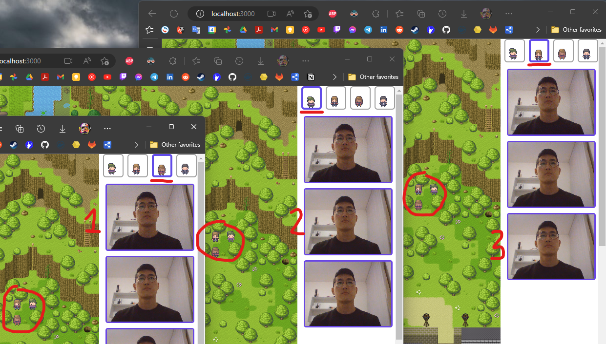
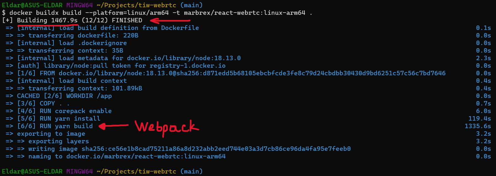

# TIW8 - TP WebRTC

> Eldar Kasmamytov p1712650  
> (Je suis en monôme)  

## Installation

### Avec Docker
Vous pouvez installer l'application en local avec Docker, l'image est sur mon [repo DockerHub](https://hub.docker.com/r/marbrex/react-webrtc).  
Vous pouvez suivre [ce guide](DOCKER.md). 

### Cloner le projet
Vous pouvez également cloner ce [repo Git](https://forge.univ-lyon1.fr/p1712650/tiw-webrtc.git).  
Pour installer les dépendances, build le client et lancer le serveur:  

```bash
make
```

L'application sera accessible sur http://localhost:3000/  

> **Attention !** Ce projet utilise Yarn version **Berry** (>= 2.0.0), qui doit être déjà installé (par exemple globalement).  

## Commandes utiles

- `make` execute ces cibles par ordre :  

  - `yarn install` pour installer les dépendances.  

  - `yarn build` pour construire le projet.  

  - `yarn start` pour lancer le serveur node.  

- `yarn dev` pour lancer le projet en mode dev, avec webpack-dev-server.  

> Pour les commandes Docker, rendez-vous sur le [DOCKER.md](DOCKER.md).  

## Fonctionnalités à noter

- **Connexion multi-peer** (en data et en vidéo).  
  Signaling entre plusieurs Peers.  

  Vous pouvez suivre la procédure de signaling en détails dans la console de votre navigateur.  
  Examples: [Initiator Peer logs](assets/peer1-logs.png) et [Responder Peer logs](assets/peer2-logs.png)  

    

  > **Remarque:** L'utilisateur n'entend que le son des autres participants. Son propre microphone est muet.  

  Cela permet une communication Peer-to-Peer entre tous les perticipants. C'est une topologie **Full Mesh**.  

  

  > **Remarque:** La connexion vidéo s'active dès que l'utilisateur a donné les permissions d'utilsier la caméra et le microphone. Il n'y a pas de condition de proximité, la connexion vidéo est globale sur toute la carte.

## Déploiement

L'application n'est pas déployée au public sur Internet.  

Je n'ai pas pu déployé sur **Heroku**, car j'ai supprimé ma carte bancaire de mon compte Heroku, sans savoir qu'elle était nécéssaire pour le déploiement (P.S. j'ai des crédits de Github Student Pack, mais ils ne sont pas valables sans un méthode de paiement). Je n'ai pas pu la rajouter non plus, car il faut attendre un mois pour pouvoir le faire...  

Mon TP précédent (React Slides) a été déployé sur mon **cluster Kubernetes** qui tourne sur des VMs `ARM`. Cela pose un problème de déploiement, car pour *build* une image **Docker** pour une autre architecture (mon PC portable est `amd64`) il faut émuler l'environnement de l'architecture cible, ce qui est **extrêmement lent**. De plus, le fait que ce soit un projet Webpack n'aide pas.  

  

Build time ~ 25 minutes  
